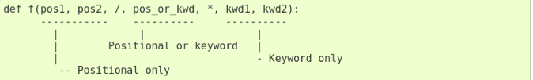

# O que são funções?

Função é um bloco de código identificado por um nome e pode receber uma lista de parâmetros, esses parâmetros podem ou não ter valores padrões. Usar funções torna o código mais legível e possibilita o reaproveitamento de código. Programar baseado em funções, é o mesmo que dizer que estamos programando de maneira estruturada.

# Retornando valores

Para retornar um valor, utilizamos a palavra reservada return. Toda função Python retorna None por padrão. Diferente de outras linguagens de programação, em Python uma função pode retornar mais de um valor.

# Args e kwargs

Podemos combinar parâmetros obrigatórios com args e kwargs. Quando esses são definidos (*args e **kwargs), o método recebe os valores como tupla e dicionário respectivamente.

# Parâmetros especiais

Por padrão, argumentos podem ser passados para uma função Python tanto por posição quanto explicitamente pelo nome. Para uma melhor legibilidade e desempenho, faz sentido restringir a maneira pelo qual argumentos possam ser passados, assim um desenvolvedor precisa apenas olhar para a definição da função para determinar se os itens são passados por posição, por posição e nome, ou por nome.

# Objetos de primeira classe

Em Python tudo é objeto, dessa forma funções também são objetos o que as tornam objetos de primeira classe. Com isso podemos atribuir funções a variáveis, passá-las como parâmetro para funções, usá-las como valores em estruturas de dados (listas, tuplas, dicionários, etc) e usar como valor de retorno para uma função (closures).

# Escopo local e escopo global

Python trabalha com escopo local e global, dentro do bloco da função o escopo é local. Portanto alterações ali feitas em objetos imutáveis serão perdidas quando o método terminar de ser executado. Para usar objetos globais utilizamos a palavra-chave global, que informa ao interpretador que a variável que está sendo manipulada no escopo local é global. Essa NÃO é uma boa prática e deve ser evitada.

*OBS: Textos tirados do slide de um curso da DIO para ESTUDOS